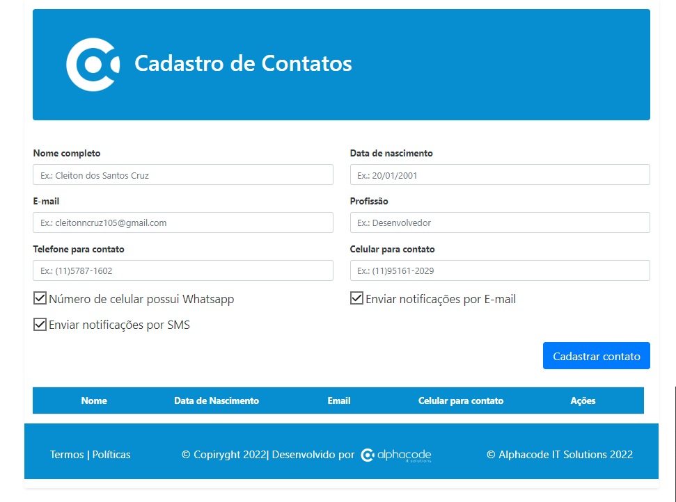

# Projeto PHP - Alphacode



---
## Sobre
Este é um projeto base em PHP que pode ser usado como ponto de partida para desenvolvimento web. Um CRUD com as tecnologias solicitadas.
---
## Tecnologias utilizadas 

- HTML
- CSS
- PHP
- MYSQL

---
## Ferramentas 

- Github
- VScode
---

## Pré-requisitos

- PHP instalado na sua máquina (versão 7.0 ou superior recomendada)
- Servidor web (por exemplo, Apache) para executar o código PHP
- O banco de dados Mysql já está na nuvem.
---

## Instalação

```bash
$ npm install
```

## Iniciar o app
- Entrar na pasta teste_alphacode e executar o código abaixo, se necessário trocar a porta.-
```bash
php -S localhost:8000
```

## Acessar o site
 [Clique Aqui](http://localhost:8000/index.php?action=index)


## Equipe

- [Cleiton](https://github.com/cotilen)
